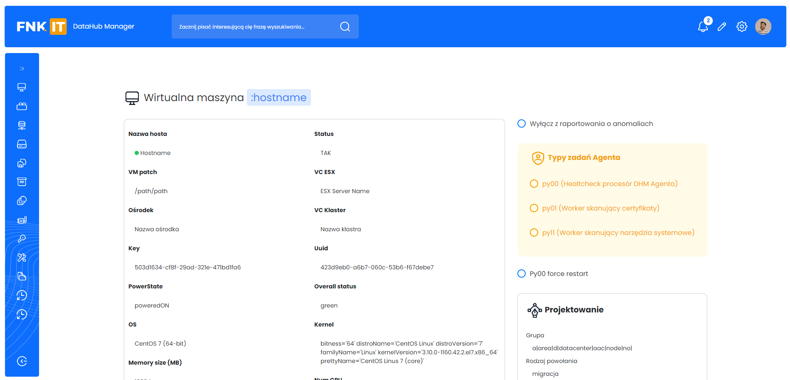

<h1 align="center">GitHub App</h1>

  

  This is a github app project made for a client 

  

## How to start  
To view the demo you need to go to the link provided below and in the search bar add the following phrases at the end:

 
/login_page.html

 
/screen1.html

 
/screen2.html

 
/screen3.html

 
/screen4.html

  

  

<a href='https://git-hub-app-sigma.vercel.app/'>View demo</a>

  

## About The Project

The site was created using bootstrap and created based on a design in figma that I got from the client. The site is not yet responsive but will be soon  

### Built With

HTML
 
SCSS(bootstrap 5.3)
 
JavaScript
 

## Contact

Jakub Pachut - jakubpachut@gmail.com

Project Link: [https://github.com/Szafter12/Mechanik-school-site](https://github.com/Szafter12/GitHub-app)
